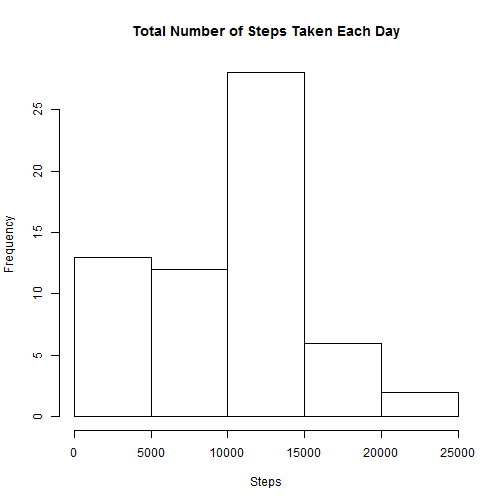
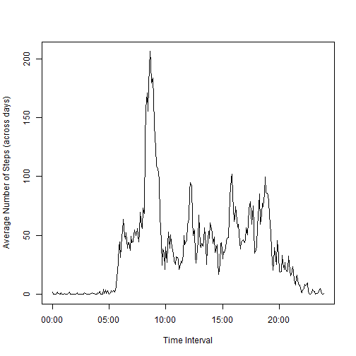
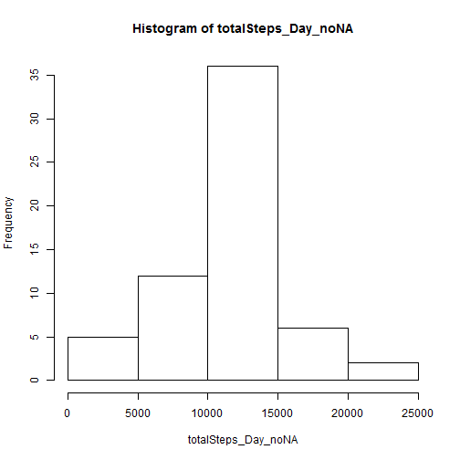

***

####Loading and preprocessing the data  

Load in relevant packages and activity.csv data.

```r
library(dplyr)
library(lattice)
options(scipen=999)

activity <- read.csv("./activity.csv", header = TRUE, na.strings="NA")
```
***  
  
####What is the mean total number of steps taken per day?  
1. Calculate the total number of steps taken per day

```r
totalSteps_Day=tapply(activity$steps, list(activity$date), sum, na.rm=TRUE)
```

2. Make a histogram of the total number of steps taken each day

```r
hist(totalSteps_Day,main="Total Number of Steps Taken Each Day",xlab="Steps")
```

 

3. Calcualte and report the mean and median of the total number of steps taken per day

```r
meanTotalSteps_Day=mean(totalSteps_Day)
medianTotalSteps_Day=median(totalSteps_Day)
```

The mean of the total number of steps taken per day is **9354**.  
the median of the total number of steps taken per day is **10395**.

***

####What is the average daily activity pattern?
1. Make a time series plot (i.e., type = "l") of the 5-minute interval (x-axis) and the average number of steps taken, averaged across all days (y-axis)

```r
meanSteps_Int=tapply(activity$steps, list(activity$interval), mean, na.rm=TRUE)
intervals <- strptime(sprintf("%04d", as.numeric(names(meanSteps_Int))), format="%H%M")
plot(intervals,meanSteps_Int, type="l",xlab="Time Interval",ylab="Average Number of Steps (across days)")   
```

 

2. Which 5-minute interval, on average across all the days in the dataset, contains the maximum number of steps?

```r
whichInt=names(which.max(meanSteps_Int))
```

The max number of steps is in the **835** interval.

***


####Imputing missing values
1. Calculate and report the total number of missing values in the dataset (i.e., the total number of rows with NAs)

```r
numNA=sum(is.na(activity$steps))
```

The total number of missing values in the dataset is **2304**.

2. Devise a strategy for filling in all the missing values in the dataset. The strategy does not need to be sophisticated. For example, you could use the mean/median for that day, or the mean for that 5-minute interval, etc.  

**My strategy will be to replcae the NAs with the mean (across days) for that 5-minute interval.**  


3. Create a new dataset that is equal to the original dataset but with the missing data filled in.


```r
activity$steps_noNA=activity$steps
activity$meanStepsInterval=rep.int(meanSteps_Int,61)    

for (i in 1:length(activity$steps)) {
    if(is.na(activity$steps[i])) {
        activity$steps_noNA[i]=activity$meanStepsInterval[i]
    }
}

activity_noNA=select(activity,steps_noNA,date,interval) #Here is the new dataset
```

4. Make a histogram of the total number of steps taken each day and calculate and report the mean and median of the total number of steps taken per day. Do these values differ from the estimates from the first part of the assignment? What is the impact of imputing missing data on the estimates of the total daily number of steps?


```r
totalSteps_Day_noNA=tapply(activity_noNA$steps_noNA, list(activity$date), sum)
hist(totalSteps_Day_noNA)
```

 

```r
meanTotalSteps_Day_noNA=round(mean(totalSteps_Day_noNA))
medianTotalSteps_Day_noNA=round(median(totalSteps_Day_noNA))

meanDiff=meanTotalSteps_Day_noNA-meanTotalSteps_Day
medianDiff=medianTotalSteps_Day_noNA-medianTotalSteps_Day
```

The mean total number of steps taken each day is **10766**.  

The median total number of steps taken each day is **10766**.  

The values **do** differ from the first estimates. The mean is **1412 steps higher** and the median is **371 steps higher** than the first estimates.  

The impact of my method of imputing missing data on the estimates of total daily number of steps is an **increase** in steps and a less skewed distribution throughout the day.

***
####Are there differences in activity patterns between weekdays and weekends?

1. Create a new factor variable in the dataset with 2 levels--"weekday" and "weekend" indicating whether a given date is a weekday or weekend.


```r
activity_noNA$date=as.Date(activity_noNA$date,"%Y-%m-%d")   #Conver to date class
activity_noNA$weekdays=weekdays(activity_noNA$date) #Use weekdays() function to get day of the week

#Create a new variable that says whether the date fell on a weekend or weekday
for (i in 1:length(activity_noNA$weekdays)) {
    if (activity_noNA$weekdays[i]=="Sunday" | activity_noNA$weekdays[i]=="Saturday") {
        activity_noNA$weekend[i]="weekend"
    }
    else {
        activity_noNA$weekend[i]="weekday"
    }
}
activity_noNA$weekend=as.factor(activity_noNA$weekend)  #Convert into a factor
```

2. Make a panel plot containing a time series plot (i.e., type="l") of the 5-minute interval (x-axis) and the average number of steps taken, averaged across all weekday days or weekend days (y-axis).  


```r
meanSteps_Weekend=tapply(activity_noNA$steps, list(activity_noNA$interval,activity_noNA$weekend), mean)

activityWeekend=as.data.frame(1:576)
activityWeekend$interval=rep(activity_noNA$interval[1:288],2)
activityWeekend$weekend=c(rep("weekday",288),rep("weekend",288))
activityWeekend$meanSteps=c(meanSteps_Weekend[,1],meanSteps_Weekend[,2])

xyplot(meanSteps~interval|weekend,data=activityWeekend,type="l",layout=c(1,2),xlab="Interval",ylab="Number of Steps")
```

 
    
There do appear to be differences between weekend and weekday activity. Activity peaks before 10am on weekdays whereas the activity is more consistent throughout the day on weekends.

